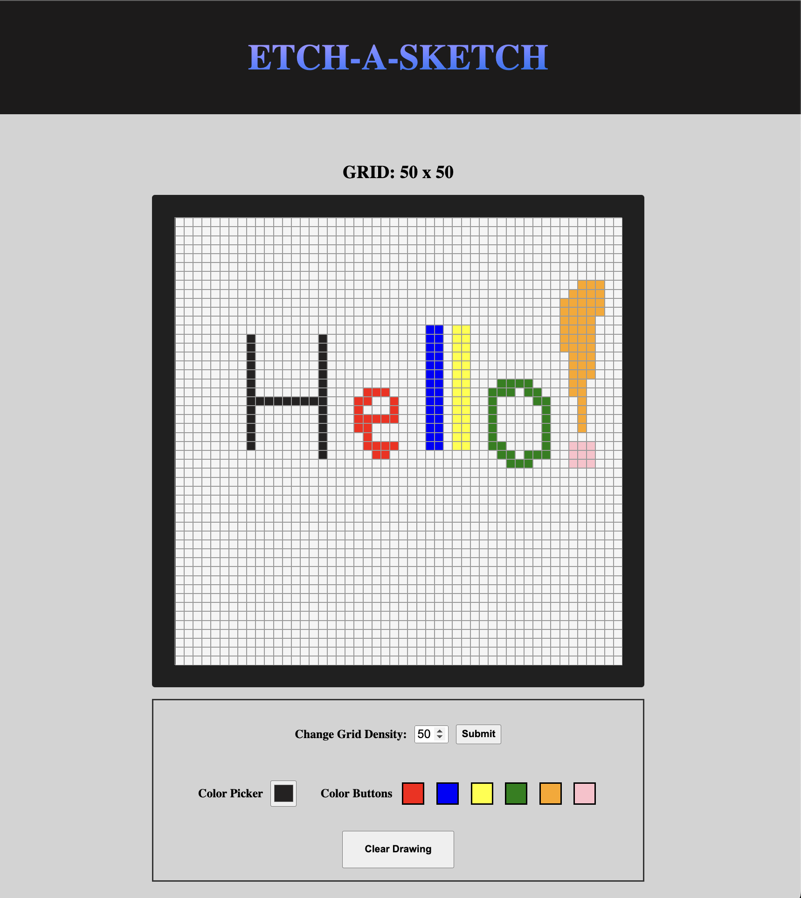

# ETCH A SKETCH

## A vanilla javaScript sketcher

### Summary

This was a 'The Odin Project' assignment.

I found it really educational and I learned a lot about DOM manipulation.

For references on the assignment please [click here](https://www.theodinproject.com/lessons/foundations-etch-a-sketch)

